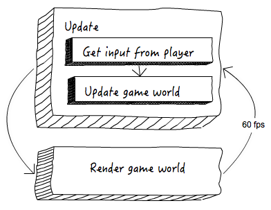

# The Game Loop

## Introduction

This is the most important pattern in game programming. Almost every game has one. Remember, a game is composed of many interacting subservices, like input/output device, collision detection, audio, and so on.
These subservices require periodic *servicing*, meaning that they need to update themselves in order to take into account the evolution of the game. To do so, we use the concept of infinite loop.

The simplest Main Loop can be written as follow:
```C
while(true)
{
    dosomething();
}
```

Most of the time, a game loop needs to handle user input in order to change the state of the game accordingly. Here is a classic game loop schema:



However, user inputs are not the only subservices making the game evolve. For example, the time or even AI bot can perform action. Thus, we need to clearly identify how the game is susceptible to evolve, and under what condition.

In the raylib tutorial, you will see a good example of the game loop:

```C
// Main game loop
    while (!WindowShouldClose())    // Detect window close button or ESC key
    {
        // Update
        //----------------------------------------------------------------------------------
        // TODO: Update your variables here
        //----------------------------------------------------------------------------------

        // Draw
        //----------------------------------------------------------------------------------
        BeginDrawing();

            ClearBackground(RAYWHITE);

            DrawText("Congrats! You created your first window!", 190, 200, 20, LIGHTGRAY);

        EndDrawing();
        //----------------------------------------------------------------------------------
    }
```

Here, we use a conditional while loop based on `̀WindowShouldClose` function (this could also be a boolean variable). This allows the player to quit the maine loop and then generally stop the game (*e.g.* press Esc or quit).

Then, the program only start the drawing context, write some text then close the context. We could imagine some additional event, such as `color=retrieveColor(InputPressed())`, waiting the user to enter a key to define the color of the background, then repeat the operation *ad vitam eternam*.

## Handling refresh rate and input

### Refresh rate
Luckily, raylib handles the refresh rate of your game quite magically. We juste have to set yout FPS via the already implemented raylib function `SetTargetFPS(60)`, juste before the main loop.
In an not so good scenario, you should have define it yourself.

```C
double previous = getCurrentTime();
double lag = 0.0;
while (true)
{
  double current = getCurrentTime();
  double elapsed = current - previous;
  previous = current;
  lag += elapsed;

  processInput();

  while (lag >= MS_PER_UPDATE)
  {
    update();
    lag -= MS_PER_UPDATE;
  }

  render();
}
```
(This approach, from [gameprogrammingpatterns](https://gameprogrammingpatterns.com/game-loop.html), prevents non-deterministic and unstable issues, that can emmerge from a classic sleep method)

### Input
Handling user input should be done just before updating the world, so that it can be updated accordingly.
```C
while (true)
{
  double start = getCurrentTime();
  processInput();
  update();
  render();
}
```


The following schema sum up a simple game loop principle.


## Deallocation
It is at the end of the game loop where all the resources should be deallocated, just before killing the program.

```C
while(true)
{
    ../
}
deallocation();
```
