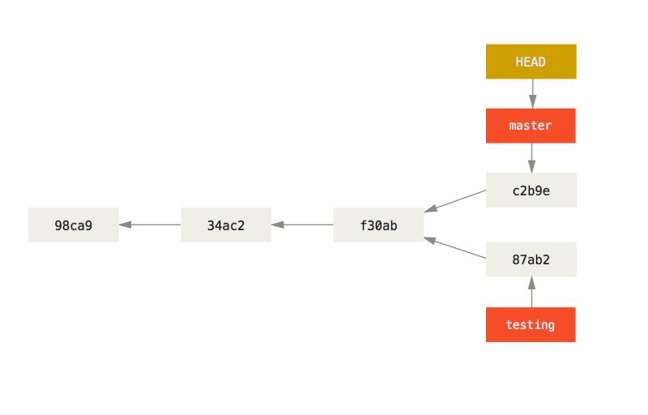

# Introduction to GIT

An excellent introduction to git is available here: [GIT-SCM, The entire Pro Git Book](https://git-scm.com/book/en/v2).

## Version Control

## GIT project
In GIT, you have two important notions: the local repository (the one in which you currently work) and remote repositories. Remote repositories are versions of the project that are hosted on the internet/network somewhere else than on your machine. Collaborating with others involves managing these remote repositories and pushing and pulling data to and from them when you need to share work. Some of them can be read-only for your, other read-write. But in any case, each system keeps a version database. One major stack of distributed versioning system is to keep the coherence of the software.


## GIT Repository
You have 4 majors ways to obtain a git repository

### Init
You can take a local directory that is currently not under version control, and turn it into a GIT repository.

```bash
cd /home/user/project
git init
```

This create all the resources needed to track the files and version control.

### Clone
You can get a copy of an existing GIT repository. The modification made localy can be directly push to the existing GIT repository. For that:

```bash
git clone https://gitlab.com/project/project.git
```

That creates a directory named `project`, initializes all the resources needed.
### Mirror
You can get a copy of an existing GIT repository and set it in a totally new GIT repository, while conserving all the versionning. For that, create a new repo on the server (*e.g.* GitHub, Gitlab) like `exampleuser/new-repository`, empty it preferably, then

```bash
git clone --bare https://gitlab.com/guillaume/networldorwhatever.git
cd networldorwhatever.git
git push --mirror https://github.com/exampleuser/new-repository.git
cd ..
rm -rf networldorwhatever.git
```

### Fork (not directly a GIT operation)
Fork is a special feature that allow to work on parallel of a repository, generally for developping new features or bug fixings, then proposing the improved code to the original repository for acceptance. In a way, you can still make your fork follow the evolution of the forked repo. Fork orperation is not a GIT operation per se, it is implemented by code hosting sites like GitHub. Thus, for GitHub, you first need to manually fork the desired repository by clicking on the fork button. Then, in order to keep your fork synced:
```bash
    git clone https://github.com/YOUR-USERNAME/YOUR_FORK_OF_THE_PROJECT
    cd YOUR_FORK_OF_THE_PROJECT
    git remote -v
    git remote add upstream https://github.com/forkedUser/PROJECT_USED_FOR_THE_FORK.git
```

then for syncing
```bash
    git fecth upstream
    git checkout master
    git merge upstream/master
```

## GIT Flow

### Files modifications

### Confirm modifications
```bash
git add FILENAME
or
git add -A
```

### Commit

### Push

## Branching


Branch ahead of master, developping a feature, and linear approach.


Desynchro and possible merge conflicts



## GIT Workflow
We recommand you to adopt the *Integration Manager Workflow*. It is a common Git workflow, which involves an integration manager — a single person who commits to the 'blessed' repository. A number of developers then clone from that repository, push to their own independent repositories, and ask the integrator to pull in their changes. This fits well with the role repartition of the project.


